> [参考内容](https://github.com/mermaid-js/mermaid/blob/develop/README.zh-CN.md)

> [live editor click there](https://mermaid-js.github.io/mermaid-live-editor/)

## 概述
Mermaid 是一个基于 Javascript 的图表绘制工具，通过解析类 Markdown 的文本语法来实现图表的创建和动态修改，可以使用这个工具来进行包括流程图，时序图等恼人的图表的绘制。可以看做是markdown的一个插件，可以直接在github中下载，也可以在一些markdown编辑器的插件中找到，这里演示是基于obsidian的[obsidian charts插件](https://github.com/phibr0/obsidian-charts)。 

如今mermaid支持以下的图表绘制
- 流程图
- 时序图
- 甘特图
- 类图
- 状态图
- 饼图
- git图(敬请期待)
- 用户体验流程图
- ...

以下将介绍这些图表的相关语法

### 流程图(flow chart)
#### 示例

```text
flowchart TD
A[Hard] -->|Text| B(Round)
B --> C{Decision}
C -->|One| D[Result 1]
C -->|Two| E[Result 2]
```
生成以下图片：
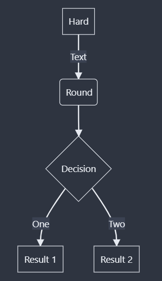
#### 流程图方向
即在`flowchart`之后的两个字母

| 字母               | 意义                                 |
| ------------------ | ------------------------------------ |
| TD、TB、什么都没有 | 从上到下(Top to Down, Top to bottom) |
| BT                 | 从下到上(Bottom to Top)              |
| RL                 | 从右到左(Right to Left)              |
| LR                 | 从左到右(Left to Right)                                     |

#### 节点形状

| 表示形式           | 图片                                 |
| ------------------ | ------------------------------------ |
| id1(aimaFAN)       |  |
| id1\(\[aimaFAN\]\) |  |
| id1\[\[aimaFAN\]\] |  |
| id1\[\(aimaFAN\)\] |  |
| id1\(\(aimaFAN\)\) |  |
| id1>aimaFAN]       |                                      |
| id1{aimaFAN}       |                                      |
| id1{{aimaFAN}}     |                                      |
| id1[/aimaFAN/]     |                                      |
| id1[\\aimaFAN\\]   |                                      |
| id1[/aimaFAN\\]    |                                      |
| id1[\\aimaFAN/]                   |                                      |

#### 节点之间的连线

| 表现形式                                         | 图片 | 
| ------------------------------------------------ | ---- |
| A-->B                                            |  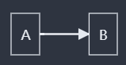    |   
| A --- B                                          |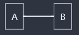      |    
| A -- text --- B                                  |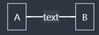      |    
| A --- \|text\|B                                  | 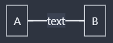     |    
| A-->\|text\|B or A-- text -->B                   | 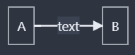     |    
| A-.->B                                           |      |    
| A-. text .-> B                                   | 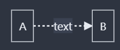     |   
| A ==>B                                           | 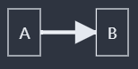     |   
| A == text ==> B                                  |     |   
| A -- text1 --> B -- text2 --> C                  | 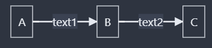     |   
| a --> b & c --> d                                |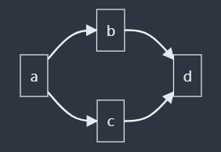      |   
| A & B--> C & D                                   | 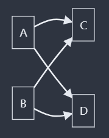     |   
| A --> C  <br/> A --> D <br> B --> C <br> B --> D | 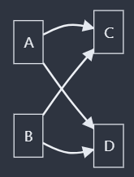     |   

#### 子图
1. flowchart中支持子图的存在，其基本语法如下
 ```text
 subgraph title
 	graph definition
end
 ```
 
 以下是示例
 ```text
 flowchart TB  
 c1-->a2  
 subgraph one  
 a1-->a2  
 end  
 subgraph two  
 b1-->b2  
 end  
 subgraph three  
 c1-->c2  
 end
 ```

得到结果如下

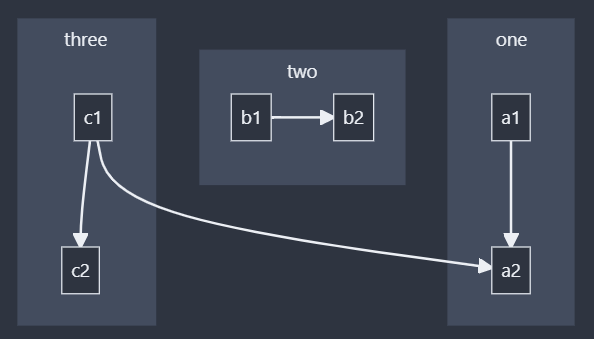

2. 子图之间同样也可以进行连接线的连接，以下是示例
	
```text
flowchart TB  
 c1-->a2  
 subgraph one  
 a1-->a2  
 end  
 subgraph two  
 b1-->b2  
 end  
 subgraph three  
 c1-->c2  
 end  
 one --> two  
 three --> two  
 two --> c2
```

得到结果如下

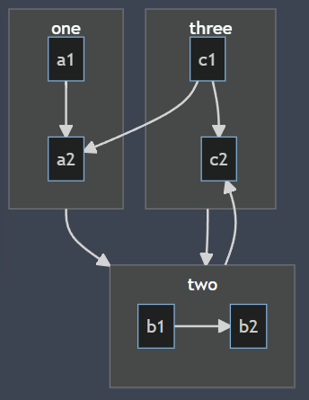

3. 子图内部还可以构造子图，以下是示例

```text
flowchart TB  
 subgraph TOP  
 direction TB  
 subgraph B1  
 direction RL  
 i1 -->f1  
 end  
 subgraph B2  
 direction BT  
 i2 -->f2  
 end  
 end  
A --> f1
B --> f2
```

得到结果如下

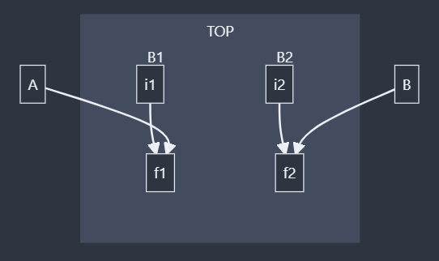

#### 一些注意事项

1. 当内部文字有破坏语法的现象时，应该这样处理

```text
flowchart
id1["This is the (text) in the box"]
```

2. 可以在流程图内部添加注释，注释加在`%%`之后